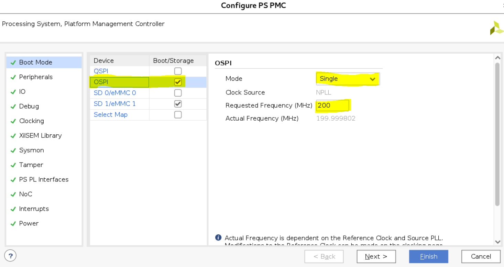

<tr>
   <td align="center"><h1>2021.1 Versal OSPI Boot Tutorial </h1>
   </td>
 </tr>
</table>

# Table of Contents

1. [Introduction](#introduction)

2. [Before You Begin](#before-you-begin)

3. [Building Hardware Design](#building-hardware-design)

4. [Building Software Design](#building-software-design)

5. [Running the Design](#running-the-design)

# Introduction
Versal™ ACAP combines adaptable processing and acceleration engines with programmable logic and configurable connectivity to enable custom, heterogeneous hardware solutions for a wide variety of applications in Data Center, automotive, 5G wireless, wired network, and defense. Versal ACAP supports several primary boot modes for application flexibility. This tutorial highlights the OSPI primary boot mode flow in sinlge mode.

The octal SPI (OSPI) boot mode has an SPI compatible serial bus interface with extended octal commands. Standard Serial Peripheral Interface (SPI) is supported along with high performance Octal SPI variants. The OSPI boot mode supports an 8-bit data bus width and single transfer rate (STR) during the RCU BootROM execution. The Octal-SPI Flash Controller transfer the data either in a memory mapped direct fashion or in an indirect fashion where the controller is set up via configuration registers to silently perform some requested operation, signalling its completion via interrupts or status registers.

## Design Block Diagram

 


## Directory Structure
<details>
<summary> Tutorial Directory Details </summary>

```
OSPI_Boot
|___Design.................Contains Design files
  |___Hardware.........................Contains Hardware Design files
    |___constraints....................Contains constraints files
  |___Software/Vitis...................Contains Vitis Design files
    |___bootimage......................Contains bootimage files
    |___src............................Contains Software source files
|___Figures................Contains figures that appear in README.md
  |___block.png........................Block Diagram
  |___ospi_config.png...........OSPI Configurations
|___Scripts................Contains TCL scripts to generate reference Design, PDI, etc...
  |___project_top.tcl..................Generates the Vivado Design
  |___vck190_bd.tcl....................Generates the VVivado Block Diagram
  |___vck190_vitis.tcl.................Generates the Vitis Design
|___README.md...............Includes tutorial overview, steps to create reference design, and debug resources
```
</details>

# Before You Begin

Recommended general knowledge of:
* VCK190 evaluation board
* Versal OSPI boot mode 
* Versal PMC
* Xilinx Vivado Design Suite 
* Xilinx Vites IDE

<details>

<summary> Key Versal Reference Documents </summary>

* VCK190 Evaluation Board User Guide [(UG1366)](https://docs.xilinx.com/r/en-US/ug1366-vck190-eval-bd))
* Versal Technical Reference Manual [(AM011)](https://www.xilinx.com/support/documentation/architecture-manuals/am011-versal-acap-trm.pdf)
* Versal System Software Developers User Guide [(UG1304)](https://www.xilinx.com/cgi-bin/docs/rdoc?v=latest;d=ug1304-versal-acap-ssdg.pdf)
* Versal Control Interfaces and Processing System (CIPS) [(PG352)](https://www.xilinx.com/cgi-bin/docs/ipdoc?c=versal_cips;v=latest;d=pg352-cips.pdf)

</details>

<details>

<summary> Versal Terms </summary>

|Term|Description|
|  ---  |  ---  |
|Platform management controller (PMC)|Manages Versal ACAP boot and the life cycle management of the device. The PMC ROM Code Unit (RCU) and platform processing unit (PPU) are responsible for booting the device.|
|ROM code unit (RCU)| Includes a microblaze processor that executes the BootROM to initiate the boot phase2: boot setup.|
|Platform processing unit (PPU)|Includes a microblaze processor that executes the platform loader and manager (PLM) to initiate the boot phase3: load platform.|
|Scalar engines|Includes the processing system (PS) Dual-Core ARM Cortex R5F and A72.|
|Adaptable engines|Includes Versal adaptable hardware also referred to in this tutorial as programmable logic (PL).|
|Control Interfaces and Processing System (CIPS)|CIPS LogiCORE IP sets the configuration of PMC/PS peripherals, clocks, and MIO.|
|BootROM|Responsible for initial security and boot mode interface checks. Reads and processes the PDI boot header. Releases the PMC PPU to complete the boot phases. See the Versal Technical Reference Manual [(AM011)](https://www.xilinx.com/support/documentation/architecture-manuals/am011-versal-acap-trm.pdf) for more detail on BootROM.|
|Platform loader and manager (PLM)|Responsible for the final boot phases to load the PDI. Executes supported platform management libraries and application user code. See the Versal System Software Developers User Guide [(UG1304)](https://www.xilinx.com/cgi-bin/docs/rdoc?v=latest;d=ug1304-versal-acap-ssdg.pdf) for more detail on the PLM.|
|Programmable device image (PDI)|Boot image for programming and configuring the Versal ACAP device. See the BootGen UG1283 for details on the format. See system software developers user guide for details on how PLM manages the images and partitions.|
|MIO| Multiplexed IO pins that can be configured for different peripherals and functions.|
|DIO| Dedicated IO pins dedicated for specific functions, such as JTAG (TCK, TMS, TDI, TDO) or power-on reset (POR_B).|

</details>

## Tutorial Requirements
Note: This tutorial targets the VCK190 evaluation board, but the methodology flow also applies to the VMK180 evaluation board.


#### Hardware Requirements:

* Host machine with an operating system supported by Vivado Design Suite and Vitis 2021.1
* VCK190 Evaluation Board, which includes:
  * Versal ACAP XCVC1902-2VSVA2197
  * AC power adapter (100-240VAC input, 12VDC 15.0A output).
  * System controller microSD card in socket (J302).
  * USB Type-C cable (for JTAG and UART communications).
  * Boot Module X-EBM-03 (OSPI)
    
#### **NOTE**:
The Boot Module is currently not available for customers but the steps highlighted in this example can be easily adopted  for a custom board with OSPI connected to Versal. For more information about the Boot Modules contact your Xilinx representative or file a Service Request.
    
#### Software Requirements:
In order to build and run the tutorial reference design, the following must be available or installed:
  * Vivado Design Suite and Vitis 2021.1:
  	- Visit https://www.xilinx.com/support/download.html for the latest tool version.
  	- For more information on installing the Vivado Design Suite and Vitis, refer to [UG1400 Vitis Unified Software Platform Embedded Software Development](https://www.xilinx.com/support/documentation/sw_manuals/xilinx2023_1/ug1400-vitis-embedded.pdf).
  * Scripts to generate the reference design are provided in the `Scripts` directory 
  * UART serial terminal recommended:
	- Vitis serial Terminal or a terminal emulator program for UART (i.e. Putty or Tera Term) can be used to display valuable PLM log boot status.  
    - When UART is not available, Vivado Design Suite and Vitis xsct/xsdb command line tools can be used to read the plm log after a boot attempt.

# Building Hardware Design  

## Vivado

To set up the Vivado environment:
* Windows 32-bit: Run the settings32.bat from the Vivado/2021.1 directory
* Windows 34-bit: Run the settings64.bat from the Vivado/2021.1 directory
* Linux 32-bit: Run the settings32.sh from the Vivado/2021.1 directory
* Linux 64-bit: Run the settings64.sh from the Vivado/2021.1 directory

Enter the `Scripts` directory. From the command line run the following to create the project:

`vivado -source project_top.tcl`

The Vivado project will be built in the `Design/Hardware` directory.

Once Vivado opens and the project is created, click on "Generate Device Image".

Wait until "Device Image Generation successfully completed" then "Open Implemented Design".
Exporting the XSA to the Software folder with the following TCL command:
```
write_hw_platform -fixed -include_bit -force -file ../Design/Software/vck190_wrapper.xsa
```
# Building Software Design 

## Vitis

To set up the Vitis environment:
* Windows 32-bit: Run the settings32.bat from the Vitis/2021.1 directory
* Windows 34-bit: Run the settings64.bat from the Vitis/2021.1 directory
* Linux 32-bit: Run the settings32.sh from the Vitis/2021.1 directory
* Linux 64-bit: Run the settings64.sh from the Vitis/2021.1 directory

Enter the `Scripts` directory. From the command line run the following:

`xsct -eval source vck190_vitis.tcl`

The Vitis project will be built in the `Design/Software/Vitis` directory.

Launch the Vitis software platform and set the workspace path to `Design/Software/Vitis`.

Apply the following modification to the project. Pre-modified files are present in the `Design/Software/Vitis/src` folder.

#### **SW Application modification**:
In helloworld.c (../Software/Vitis/hello_a72_0/src), add a delay to avoid application prints collide with the PLM prints.

```
 sleep(1);
 print("Hello World\n\r");
 print("Successfully ran Hello World application from OSPI.");
 ```
 Be sure to re-build the Hello world application after the changes are applied.

#### **Generate a Boot Image (PDI)**:
Generate a Boot Image (PDI) using the following bootgen command and the output.bif already present in the `Design/Software/bootimage` folder:
```
bootgen -arch versal -image output.bif -o BOOT.PDI -w
```
output.bif:
```
/*vck190_ospi*/
the_ROM_image:
{
	image 
	{
		{ type=bootimage, file= ../vck190_wrapper/hw/vck190_wrapper.pdi  } 
		{ type=bootloader, file= ../plm/Debug/plm.elf  } 
	}
	image
	{
		name=apu_subsystem
		id = 0x1c000000
		{ core=a72-0, exception_level=el-3, trustzone, file= ../hello_a72_0/Debug/hello_a72_0.elf } 
	}
}
```
## **Running the Design**
#### **NOTE**:
Find vck190_wrapper.pdi in vivado project build directory and name it `vck190_ospi_prog.pdi` and use it in the flash programming steps below to make it faster.

Execute the following command on XSCT in order to program the BOOT.PDI file into OSPI flash. Xilinx strongly recommend to boot the Versal Device in JTAG boot mode (SW1 = 0000 (all ON)) to reliably program the OSPI.
```
xsct% program_flash -f BOOT.PDI -pdi vck190_ospi_prog.pdi -offset 0x0 -flash_type ospi-x8-single
```
#### **Flash programming log**:
```

xsdb% program_flash -f BOOT.PDI -pdi design_1_wrapper.pdi -offset 0x0 -flash_type ospi-x8-single -url TCP:XXXXXXXXX:XXXX
WARNING: [Common 17-259] Unknown Tcl command 'program_flash -f BOOT.PDI -pdi design_1_wrapper.pdi -offset 0x0 -flash_type ospi-x8-single -url TCP:XXXXXXXXX:XXXX' sending
command to the OS shell for execution. It is recommended to use 'exec' to send the command to the OS shell.

****** Xilinx Program Flash
****** Program Flash v2021.1 (64-bit)
  **** SW Build 3246112 on 2021-06-09-14:19:56
    ** Copyright 1986-2020 Xilinx, Inc. All Rights Reserved.


Connected to hw_server @ TCP:XXXXXXXXX:XXXX

Retrieving Flash info...

Initialization done
Using default mini u-boot image file - ../Vitis/2021.1/data/xicom/cfgmem/uboot/versal_ospi_x8_single.bin


U-Boot 2021.01-08077-gfb43236 (May 17 2021 - 10:30:49 -0600)

Model: Xilinx Versal MINI OSPI SINGLE
DRAM:  WARNING: Initializing TCM overwrites TCM content
256 KiB
EL Level:	EL3
Versal> sf probe 0 0 0
SF: Detected mt35xu02g with page size 256 Bytes, erase size 4 KiB, total 256 MiB
Versal> Sector size = 4096.
Total size = 268435456.
f probe 0 0 0
Performing Erase Operation...
sf erase 0 197000
SF: 1667072 bytes @ 0x0 Erased: OK
Versal> Erase Operation successful.
INFO: [Xicom 50-44] Elapsed time = 7 sec.
Performing Program Operation...
0%...sf write FFFC0000 0 20000
device 0 offset 0x0, size 0x20000
SF: 131072 bytes @ 0x0 Written: OK
Versal> sf write FFFC0000 20000 20000
device 0 offset 0x20000, size 0x20000
SF: 131072 bytes @ 0x20000 Written: OK
Versal> sf write FFFC0000 40000 20000
device 0 offset 0x40000, size 0x20000
SF: 131072 bytes @ 0x40000 Written: OK
Versal> sf write FFFC0000 60000 20000
device 0 offset 0x60000, size 0x20000
SF: 131072 bytes @ 0x60000 Written: OK
Versal> sf write FFFC0000 80000 20000
device 0 offset 0x80000, size 0x20000
SF: 131072 bytes @ 0x80000 Written: OK
Versal> sf write FFFC0000 A0000 20000
device 0 offset 0xa0000, size 0x20000
SF: 131072 bytes @ 0xa0000 Written: OK
Versal> 50%...sf write FFFC0000 C0000 20000
device 0 offset 0xc0000, size 0x20000
SF: 131072 bytes @ 0xc0000 Written: OK
Versal> sf write FFFC0000 E0000 20000
device 0 offset 0xe0000, size 0x20000
SF: 131072 bytes @ 0xe0000 Written: OK
Versal> sf write FFFC0000 100000 20000
device 0 offset 0x100000, size 0x20000
SF: 131072 bytes @ 0x100000 Written: OK
Versal> sf write FFFC0000 120000 20000
device 0 offset 0x120000, size 0x20000
SF: 131072 bytes @ 0x120000 Written: OK
Versal> sf write FFFC0000 140000 20000
device 0 offset 0x140000, size 0x20000
SF: 131072 bytes @ 0x140000 Written: OK
Versal> sf write FFFC0000 160000 20000
device 0 offset 0x160000, size 0x20000
SF: 131072 bytes @ 0x160000 Written: OK
Versal> 100%
sf write FFFC0000 180000 16D70
device 0 offset 0x180000, size 0x16d70
SF: 93552 bytes @ 0x180000 Written: OK
Versal> Program Operation successful.
INFO: [Xicom 50-44] Elapsed time = 15 sec.

Flash Operation Successful
```
#### **Boot the Boot Image (PDI) from OSPI**:
There are two ways to test the design once the OSPI is programmed.

##### **Method #1**:
Change the Versal Device boot mode to OSPI (SW1 = 0001 (ON-ON-ON-OFF)) and power on the board.

##### **Method #2**: 
Change the Versal Device boot mode to JTAG (SW1 = 0000 (ON-N-ON-ON)), power on the board and run the following script:
```
tar -set -filter {name =~ "Versal *"}
# Enable ISO
mwr -force 0xf1120000 0xffbff
# Switch boot mode
mwr 0xf1260200 0x8100
mrd 0xf1260200
# Set MULTIBOOT address to 0
mwr -force 0xF1110004 0x0
# SYSMON_REF_CTRL is switched to NPI by user PDI so ensure its
# switched back
mwr -force 0xF1260138 0
mwr -force 0xF1260320 0x77
# Perform reset
tar -set -filter {name =~ "PMC"}
rst
```
This script change the boot mode from JTAG to OSPI without the need of power cycle the board.

#### **PLM log when booting from OSPI**:
To see the PLM Log the user can look at the UART console or use the XSDB command "plm log" from target 1 (`tar -set -filter {name =~ "Versal *"}`):

``` 
[340.116]****************************************
[344.565]Xilinx Versal Platform Loader and Manager 
[349.187]Release 2021.1   Jun 28 2021  -  10:19:41
[353.722]Platform Version: v1.0 PMC: v1.0, PS: v1.0
[358.343]BOOTMODE: 0x8, MULTIBOOT: 0x0
[361.832]****************************************
[366.320] 57.275 ms for Partition#: 0x1, Size: 2288 Bytes
[371.423]---Loading Partition#: 0x2, Id: 0xB
[376.002] 0.536 ms for Partition#: 0x2, Size: 48 Bytes
[380.316]---Loading Partition#: 0x3, Id: 0xB
[384.536] 0.175 ms for Partition#: 0x3, Size: 60592 Bytes
[389.471]---Loading Partition#: 0x4, Id: 0xB
[393.544] 0.029 ms for Partition#: 0x4, Size: 5968 Bytes
[398.539]---Loading Partition#: 0x5, Id: 0xB
[402.595] 0.012 ms for Partition#: 0x5, Size: 80 Bytes
[407.496]+++Loading Image#: 0x2, Name: pl_cfi, Id: 0x18700000
[412.929]---Loading Partition#: 0x6, Id: 0x3
[466.471] 49.495 ms for Partition#: 0x6, Size: 707472 Bytes
[468.945]---Loading Partition#: 0x7, Id: 0x5
[498.177] 25.186 ms for Partition#: 0x7, Size: 427680 Bytes
[500.692]+++Loading Image#: 0x3, Name: fpd, Id: 0x0420C003
[505.885]---Loading Partition#: 0x8, Id: 0x8
[510.371] 0.440 ms for Partition#: 0x8, Size: 1024 Bytes
[515.248]+++Loading Image#: 0x4, Name: subsystem, Id: 0x1C000000
[520.718]---Loading Partition#: 0x9, Id: 0x3
[525.215] 0.451 ms for Partition#: 0x9, Size: 163920 Bytes
[530.054]***********Boot PDI Load: Done***********
[534.538]27.785 ms: ROM Time
[537.122]Total PLM Boot Time 
Hello World
Successfully ran Hello World application from ospi
```

## **Conclusion**

The design steps and build instructions are used to create an OSPI boot image and the new bif format helps to add user partitions. The plm boot log gives partitions load information with the boot times.

© Copyright [2020] Xilinx, Inc. All rights reserved.
